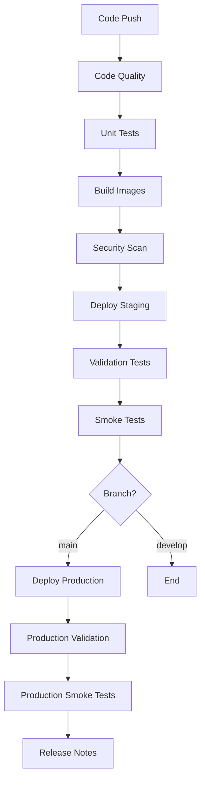

# CI/CD Pipeline Documentation

## Overview
This repository contains a comprehensive CI/CD pipeline that automates the entire software development lifecycle for your microservices architecture. The pipeline leverages your existing validated scripts and provides robust automation for building, testing, security scanning, and deployment.

## Pipeline Components

### 1. Main CI/CD Pipeline (`ci-cd-pipeline.yml`)
**Triggers:** Push to main/develop, PRs to main, manual dispatch
**Features:**
- Code quality checks (Checkstyle, secret scanning)
- Parallel unit/integration testing for all services
- Container image building and security scanning with Trivy
- Automated deployment to staging (develop branch) and production (main branch)
- Comprehensive validation and smoke testing

### 2. Service-Specific Pipeline (`service-specific-cicd.yml`)
**Triggers:** Changes to services/**, manual dispatch
**Features:**
- Detects changed services automatically
- Optimized builds only for modified services
- Parallel execution for multiple changed services
- Independent deployment validation per service

### 3. Security & Compliance (`security-scan.yml`)
**Triggers:** Daily schedule, security file changes, manual dispatch
**Features:**
- Comprehensive Trivy security scanning (code, containers, IaC)
- Secret detection across the repository
- Kubernetes policy compliance checks
- Automated security reporting

### 4. Infrastructure Management (`infrastructure.yml`)
**Triggers:** Infrastructure file changes, manual dispatch
**Features:**
- Terraform validation, planning, and deployment
- Helm chart linting and validation
- Infrastructure bootstrapping and secret management
- Environment-specific deployments with approval gates

### 5. Health Monitoring (`monitoring.yml`)
**Triggers:** Every 15 minutes, manual dispatch
**Features:**
- Service health checks across all microservices
- Infrastructure monitoring and resource usage
- Performance testing with k6
- Automated alerting on failures

### 6. Release Management (`release.yml`)
**Triggers:** Version tags (v*), manual dispatch
**Features:**
- Automated release artifact creation
- Multi-environment deployment strategies
- GitHub release creation with changelog
- Helm chart packaging and distribution

## Script Integration

Your existing scripts are fully integrated into the pipelines:

| Script | Pipeline Usage | Purpose |
|--------|----------------|---------|
| `docker-build-all.sh` | Main CI/CD, Release | Build and push all container images |
| `run_tests.sh` | All pipelines | Execute unit/integration tests |
| `scan_security.sh` | Security, Main CI/CD | Trivy security scanning |
| `scan_secrets.sh` | Security | Secret detection |
| `deploy_all_services.sh` | Main CI/CD, Release | Deploy all services via Helm |
| `deploy_service.sh` | Service-specific | Deploy individual services |
| `validate_deploy.sh` | All deployment pipelines | Validate deployments |
| `smoke_test_all_services.sh` | Main CI/CD, Monitoring | End-to-end testing |
| `smoke_test_a_service.sh` | Service-specific, Monitoring | Individual service testing |
| `bootstrap_state.sh` | Infrastructure | Initialize cluster state |
| `create_secrets.sh` | Infrastructure | Manage Kubernetes secrets |
| `validate_infra.sh` | Infrastructure, Monitoring | Infrastructure validation |

## Environment Configuration

### Required Secrets
Set these in your GitHub repository settings (Settings > Secrets and variables > Actions):

```bash
# Kubernetes Access
KUBE_CONFIG_STAGING=<base64-encoded-kubeconfig-for-staging>
KUBE_CONFIG_PRODUCTION=<base64-encoded-kubeconfig-for-production>

# Cloud Provider (if using GCP)
GCP_SA_KEY=<service-account-json-key>

# Application Secrets
DB_PASSWORD_STAGING=<staging-database-password>
DB_PASSWORD_PRODUCTION=<production-database-password>
JWT_SECRET_STAGING=<staging-jwt-secret>
JWT_SECRET_PRODUCTION=<production-jwt-secret>
```

### Environment Protection Rules
1. **Staging Environment:**
   - Auto-deploy from `develop` branch
   - No approval required
   - Used for integration testing

2. **Production Environment:**
   - Auto-deploy from `main` branch
   - Requires manual approval (recommended)
   - Protected with deployment gates

## Workflow Execution

### Automatic Triggers

1. **Pull Request:** Code quality + testing only
2. **Push to develop:** Full pipeline → staging deployment
3. **Push to main:** Full pipeline → production deployment
4. **Service changes:** Optimized service-specific pipeline
5. **Infrastructure changes:** Infrastructure validation and deployment
6. **Scheduled:** Security scans (daily), health monitoring (15min)

### Manual Triggers

All workflows support manual execution with parameters:
- Target environment selection
- Specific service deployment
- Security scan type selection
- Infrastructure actions (plan/apply/destroy)

## Pipeline Flow



## Monitoring & Alerting

The monitoring pipeline provides:

- **Service Health:** Individual service health checks
- **Infrastructure Health:** Cluster and resource monitoring
- **Performance Metrics:** Load testing and response time monitoring
- **Security Monitoring:** Continuous vulnerability scanning
- **Automated Reporting:** Detailed status reports and failure alerts

## Best Practices Implemented

1. **Security First:** Every image and code change is security scanned
2. **Fail Fast:** Quick feedback with parallel execution
3. **Environment Parity:** Consistent deployment across environments
4. **Rollback Ready:** Tagged releases for easy rollback
5. **Observability:** Comprehensive monitoring and logging
6. **Cost Optimization:** Service-specific pipelines reduce unnecessary builds

## Customization Options

### Modify Service List
Update the service matrix in workflows:
```yaml
services: [identity, product, cart, order, payment, api-gateway]
```

### Adjust Security Scanning
Configure Trivy scanning parameters:
```bash
NO_PROGRESS=1  # Hide progress bars in CI
FAST=1         # Skip secret scanning for speed
TRIVY_TIMEOUT=15m  # Scan timeout
```

### Environment-Specific Configuration
Use Helm values files for environment-specific settings:
```bash
helm install ... -f values-staging.yaml
helm install ... -f values-production.yaml
```

## Troubleshooting

### Common Issues

1. **Pipeline Failures:**
   - Check script permissions (`chmod +x`)
   - Verify secret configuration
   - Review deployment logs

2. **Security Scan Failures:**
   - Update base images for vulnerabilities
   - Review and whitelist acceptable risks
   - Check Trivy database updates

3. **Deployment Issues:**
   - Validate Kubernetes connectivity
   - Check resource limits and quotas
   - Verify Helm chart syntax

### Getting Help

1. Review workflow logs in GitHub Actions
2. Check script output for detailed error messages
3. Validate infrastructure with `./scripts/validate_infra.sh`
4. Test deployments with `./scripts/validate_deploy.sh`

## Next Steps

1. Configure repository secrets
2. Set up environment protection rules
3. Run initial pipeline to validate setup
4. Customize monitoring thresholds
5. Implement additional security policies as needed

This comprehensive CI/CD setup provides enterprise-grade automation while leveraging your existing, tested scripts for reliability and consistency.
